English · [日本語](README.md)

# MorseTree Visualizer - Learn Morse code as paths through a tree


[](https://ipusiron.github.io/morse-tree-visualizer/)

**Day025 - 100 Security Tools with Generative AI**

MorseTree Visualizer highlights each character's Morse code as a path through a tree.
Encoding, decoding, and hands-on practice help connect the characters, signals, and paths.

## 🌐 Demo

[Open MorseTree Visualizer in a browser](https://ipusiron.github.io/morse-tree-visualizer/)

## 📸 Screenshots

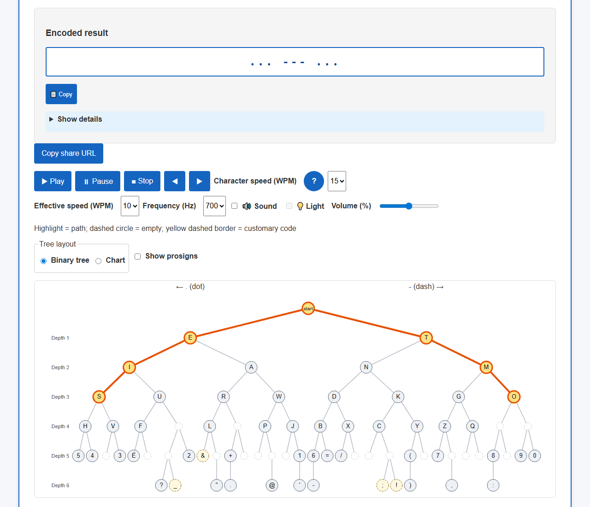
> *SOS encoded with the S and O paths highlighted together. The details table is closed. 1280×1100 px, 81,147 bytes.*

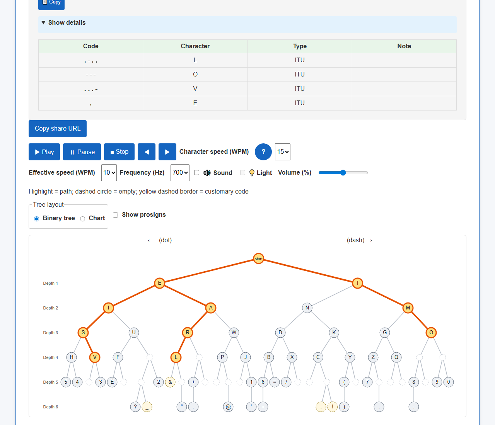
> *The decoded result, details table, and tree paths for the ASCII input `.-.. --- ...- .`. 1280×1100 px, 84,712 bytes.*

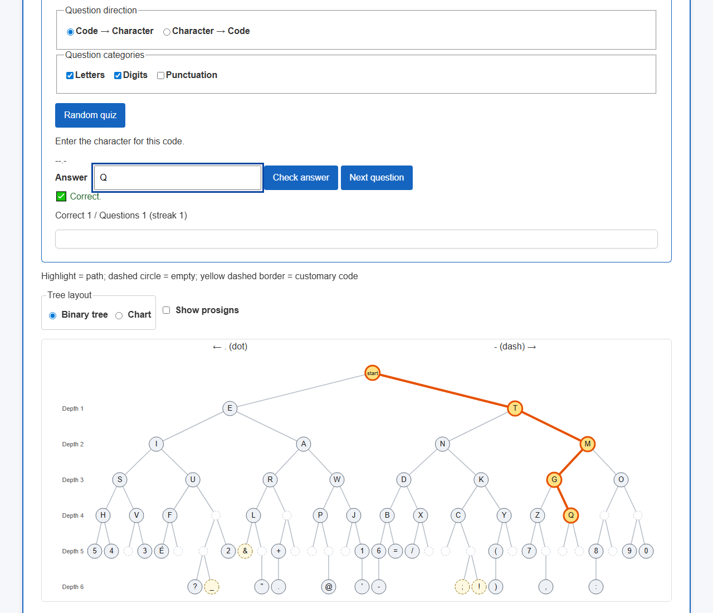
> *Q answered correctly in a code-to-character quiz: Correct 1 / Questions 1 (streak 1). 1280×1100 px, 82,298 bytes.*

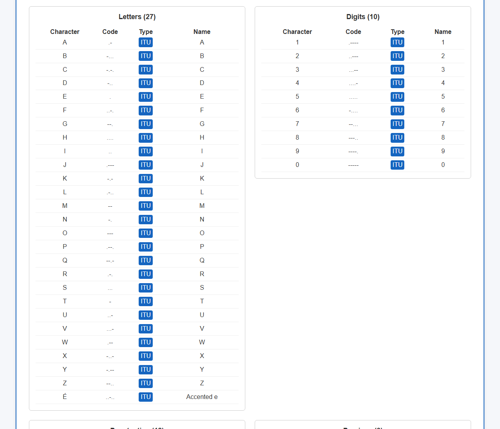
> *The Letters and Digits groups, with ITU badges and the Name column. 1280×1100 px, 32,201 bytes.*

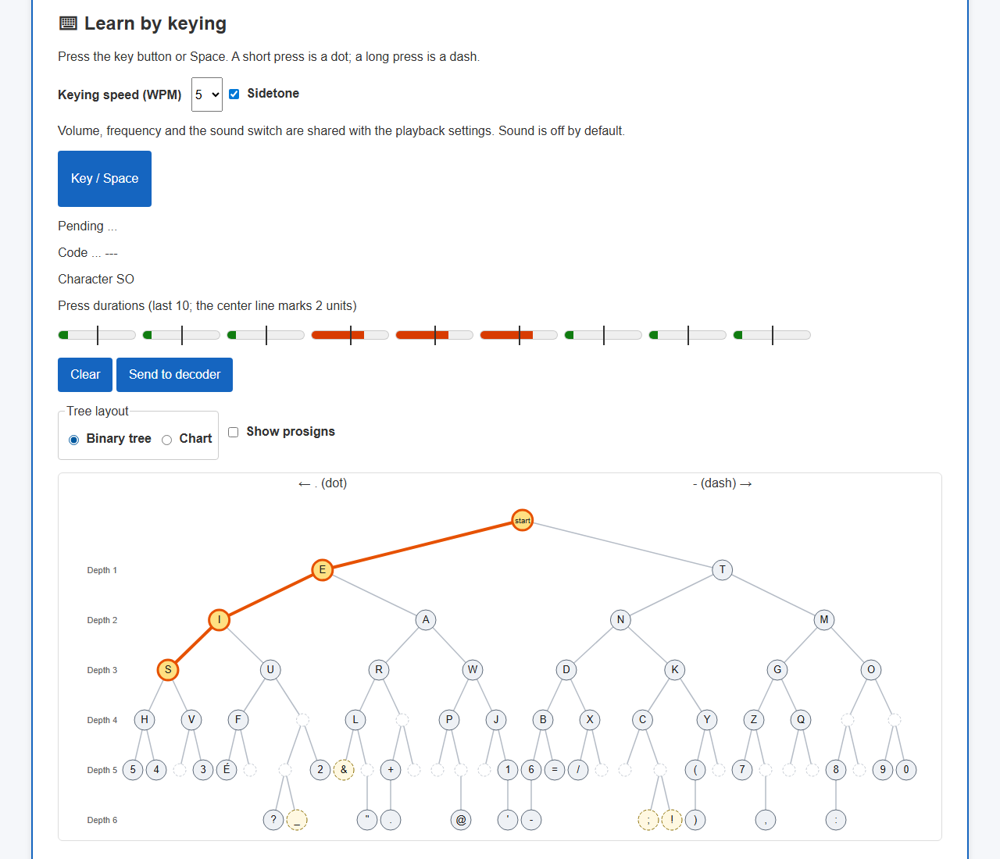
> *SOS keyed with SO committed and the final S still pending and highlighted. Press durations are also shown. 1280×1100 px, 78,921 bytes.*

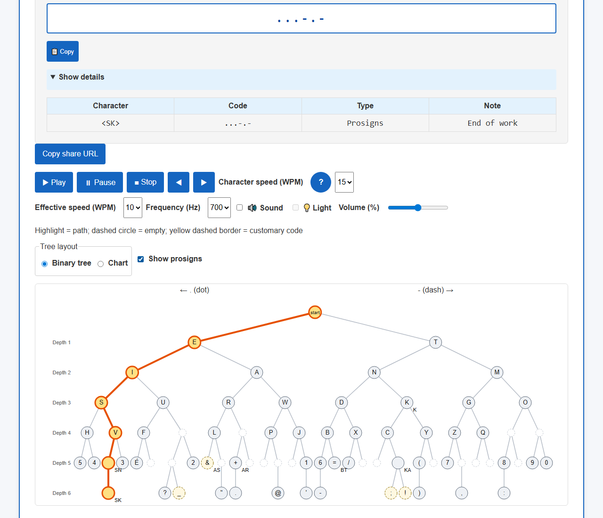
> *`<SK>` encoded with prosign labels displayed. 1280×1100 px, 86,447 bytes.*

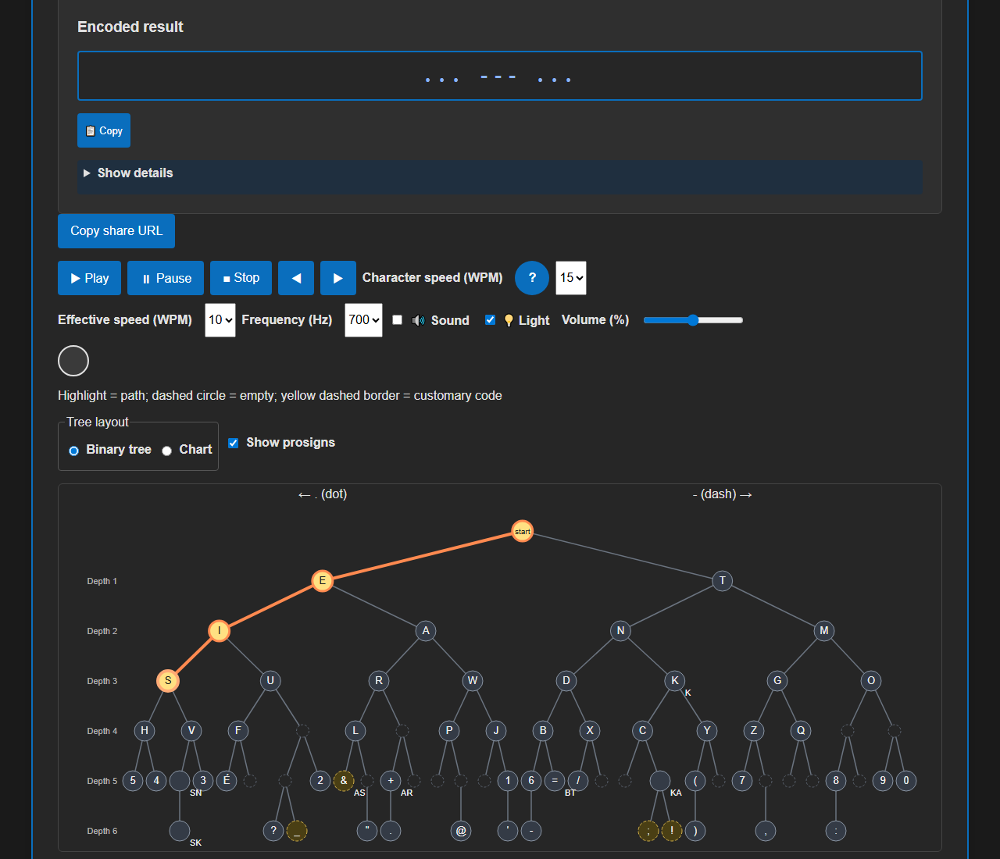
> *The final S path after playing SOS, sound settings, and the light in the dark theme. 1280×1100 px, 81,913 bytes.*

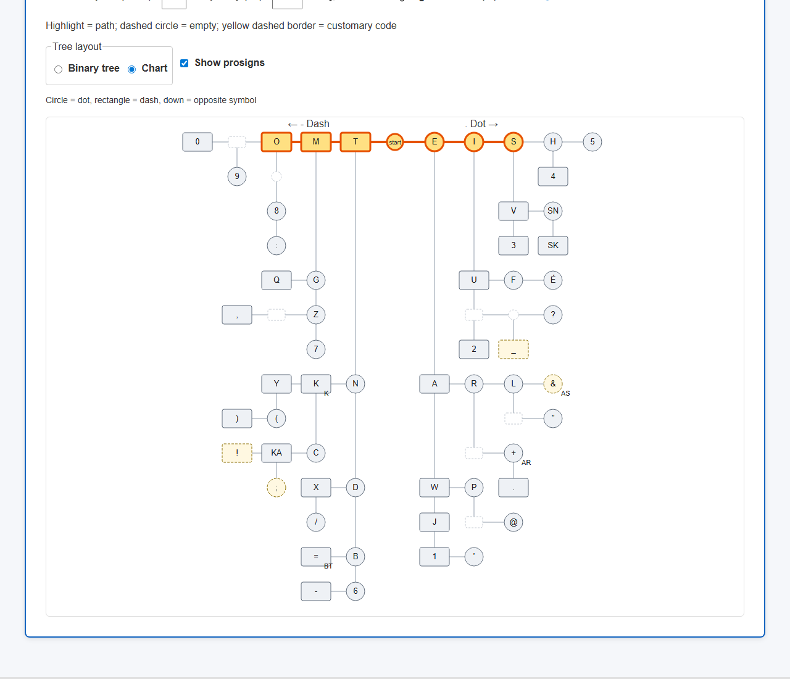
> *S and O paths highlighted together in Chart view, with the SN and SK prosigns visible. 1280×1100 px, 53,809 bytes.*

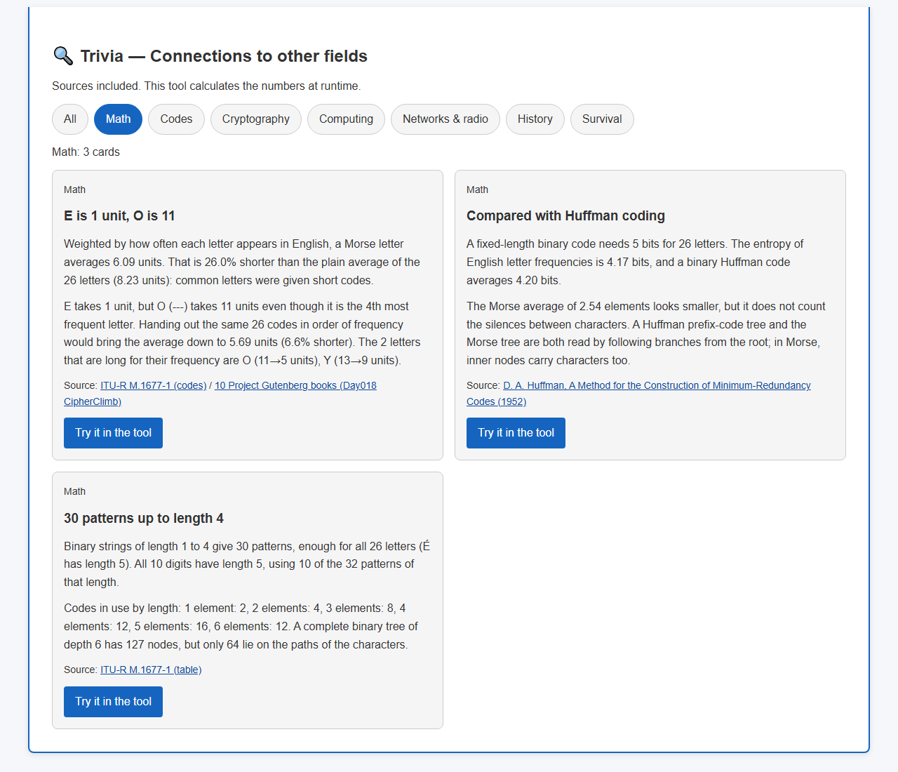
> *The cards on average code length, Huffman coding, and combinations, with their sources. 1280×1100 px, 79,372 bytes.*

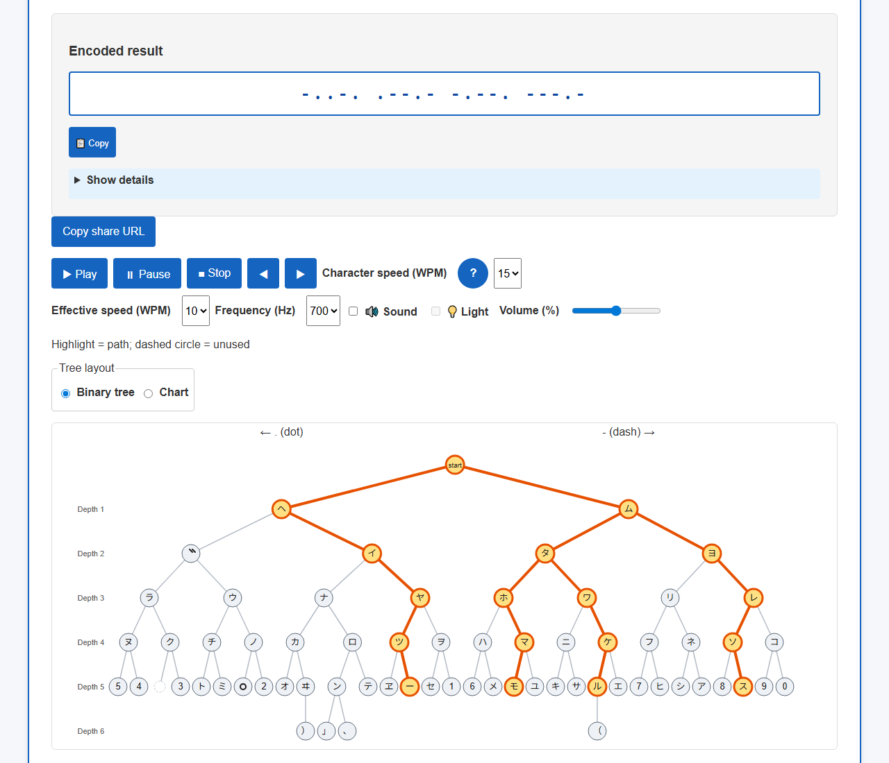
> *The four kana of moorusu encoded with all paths highlighted in the binary tree. 1280×1100 px, 83,517 bytes.*

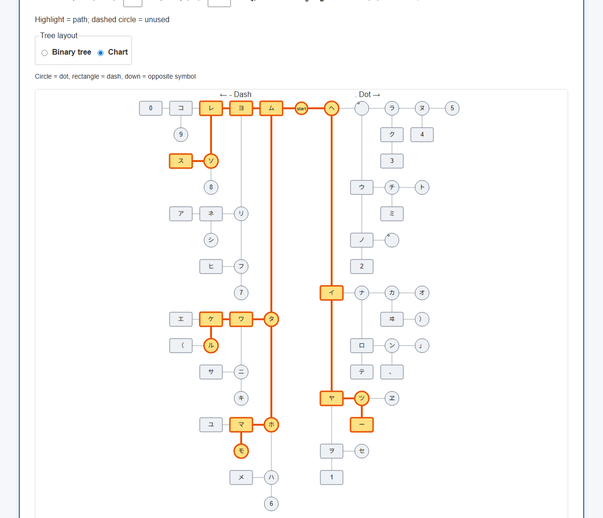
> *The Wabun paths for moorusu highlighted in Chart view. 1280×1100 px, 57,573 bytes.*

## ✨ Features

- Six tabs: Text ⇒ Morse, Morse ⇒ Text, Study, Morse Table, Keying, and Trivia
- Japanese/English interface switching, saved language choice, and `?lang=ja` / `?lang=en` links
- International/Wabun code switching, 65 Wabun entries for conversion and study, saved code choice, and `?code=wabun` links
- Binary tree / Chart views, synchronized across four diagrams with a saved preference
- 16 sourced trivia cards in seven fields, runtime calculations, and Try in the tool actions
- Input, display, and copying in ASCII `.-` or `・−` notation
- ITU-timed path playback, pause/resume/stop, and manual forward/backward steps
- Synchronized sound and tree highlighting, adjustable frequency and volume, and an optional small light
- Farnsworth timing with separate character and effective speeds (character speed: 5–25 WPM)
- Keying with Space, mouse, or touch, with sidetone and press-duration bars
- Nine prosigns and shareable URLs containing up to 1,000 input characters
- Light, dark, and system themes, plus a printable Morse table for PDF output
- Live following of the current code as it is entered in the decoder
- Quizzes in both directions, selectable categories, and session-only scores and streaks
- 50 ITU characters and five customary characters, with a depth-6 tree and outside-tree notes
- Keyboard and mobile support: the tree scrolls inside its container instead of shrinking

## 📖 Usage

Choose International or Wabun in Code at the top of the page.
The English-text examples and prosigns below use International.
Wabun offers kana samples for moorusu, iroha, gakkou, and sakura saku.

### 📝 Text ⇒ Morse encoding

1. Select the Text ⇒ Morse tab.
2. Enter text, such as `HELLO`.
3. Click Encode & show.
4. Read the Morse code and follow the animated tree paths.
5. Click 📋 Copy to copy the result to the clipboard.

### 🔓 Morse ⇒ Text decoding

1. Select the Morse ⇒ Text tab.
2. Enter Morse code directly or use the character buttons.
3. Choose a sample: ASDF GHJK, SOS, HELLO WORLD, or CQ CQ DE JA1ABC.
4. Click Decode or press Enter in the input (Shift+Enter inserts a newline).
5. Read the decoded text and follow the tree playback.

### 📚 Study

- Character lookup: choose a character to see its Morse code and path
- Random quiz: answer code-to-character or character-to-code questions using letters, digits, or punctuation; press Enter to check, then Enter again for the next question

### 📊 Morse Table

Look up 27 letters, 10 digits, 18 punctuation characters, and nine prosigns.
ITU and customary badges distinguish the entries, and the selected notation applies to the table.
Wabun instead has four groups: 48 kana, two voicing marks, 10 digits, and five symbols, with names replacing the Type column.
In the English interface, the kana Name cells show Hepburn romanization.

### ⌨ Keying

1. Select the ⌨ Keying tab and choose a keying speed.
2. Press Key / Space or the Space key briefly for a dot, or hold it for a dash.
3. Check the pending code, decoded characters, and press-duration bars.
4. Select Send to decoder to move the entered code to the decoding tab.

Enter prosigns in angle brackets in the text field, as in `HELLO <AR>`.
This sends one procedure signal, not the separate letters A and R.

### Input and conversion examples

Newlines, tabs, and full-width spaces separate words when encoding.
In the table, `(newline)` means an actual line break and `(3 spaces)` means three ordinary spaces.

| Operation | Input | Result |
|---|---|---|
| encode | `SOS` | `・・・ −−− ・・・` |
| encode | `HELLO WORLD` | `・・・・ ・ ・−・・ ・−・・ −−− / ・−− −−− ・−・ ・−・・ −・・` |
| encode | `Hello,(newline)World!` | `・・・・ ・ ・−・・ ・−・・ −−− −−・・−− / ・−− −−− ・−・ ・−・・ −・・ −・−・−−` |
| decode | `.- ...` | `AS` |
| decode | `.-(3 spaces)...` | `A S` |

Changing the notation updates results, copied text, and the table.
For example, SOS in ASCII notation is `... --- ...`.
Conversion starts playback automatically.
With reduced motion enabled in the browser, all paths for the text are highlighted at once.
Manual steps are available in either mode.

### WPM (playback speed)

WPM is the speed of Morse code: smaller values are slower and larger values are faster.
20 WPM is twice as fast as 10 WPM.
Start at 5 WPM to follow the tree paths slowly.
After changing the speed, press Play to restart at the selected speed.

The ? beside WPM in the encoding and decoding tabs also explains the setting.
Hover, tap, or focus it with the keyboard to open the explanation.
Press Esc, click or tap again, or click or tap outside it to close it; moving on with Tab also closes it.
Reduced motion highlights all paths at once regardless of WPM, so use manual steps to follow them in sequence.

### 🧭 Layout

Choose Binary tree or Chart in the Layout controls above the diagram.
The choice applies to all four diagrams and is remembered for the next visit.
Switching still works within the page when storage is blocked.
Changing the layout clears highlights and stops playback; press Play to listen again.

### 🔍 Trivia

Open Trivia and select a field to filter the cards. All returns to all 16 cards.
Source links open the supporting material.
Cards with Try in the tool take you to the related tab.
When a card provides an example, it fills and converts the input without starting sound or playback.

## 📐 Interface

The top of the page contains six tabs, the notation selector, and the Code selector.
Each conversion tab contains input, results, playback controls, and a diagram.
Study is split into character lookup and random quizzes. Open Help with ? at the top right.

Use EN / JA in the header to switch the interface language.
The initial language comes from `?lang=ja` / `?lang=en`, then the saved choice, then the browser language; non-Japanese browser languages use English.
English starts with ASCII `.-` notation; Japanese starts with `・−`.
Once notation has been selected manually, switching languages preserves that choice.
Language changes preserve input, results, highlights, the selected tab, and scroll position.
They stop any current playback and never start sound.

- Tab navigation: ← / →; first/last tab: Home / End
- Decode: Enter in the input; newline: Shift+Enter
- Check quiz answer / next question: Enter in the answer field
- Close Help: Esc; focus returns to the button that opened it

## 🎯 Use cases

- Character-to-code practice for beginners and hobby learners
- Supplementary Morse practice for amateur radio
- Signal-processing demonstrations in IT and STEM education
- Binary-tree and traversal-path demonstrations for programming classes
- Learning the difference between encoding and encryption in security education

## 🔊 Sound and Farnsworth timing

Set Character speed to 18 WPM and Effective speed to 5 WPM to hear each character at 18 WPM with longer gaps between characters and words.
Default playback has sound off, character speed 15 WPM, effective speed 10 WPM, 700 Hz, and 50% volume.
Effective speed is capped at character speed.
Enable 🔊 Sound, then start playback to hear it.
Enabling Sound alone does not create an AudioContext; the first subsequent playback action creates it.
The tree remains usable when sound is off or unavailable.

For character speed c and effective speed s, one unit is `1200/c` ms.
When s<c, calculate `a=(60c−37.2s)/(s×c)×1000` ms and replace the character gap with `3a/19` and the word gap with `7a/19`.
These values replace the ordinary 3-unit and 7-unit gaps; they are not added to them.
When s=c, the ordinary timing ratios apply.

| Character speed c | Effective speed s | Unit (ms) | Character gap (ms) | Word gap (ms) |
|---|---|---|---|---|
| 15 | 15 | 80.0 | 240.0 | 560.0 |
| 18 | 10 | 66.7 | 621.1 | 1449.1 |
| 18 | 5 | 66.7 | 1568.4 | 3659.6 |

Including the gap after PARIS, one word takes 60/s seconds: 12 seconds at 18/5 WPM.
The calculation follows [ARRL's Farnsworth timing standard](https://www.arrl.org/files/file/Technology/x9004008.pdf).

The light is 40 px square and off by default.
It keeps the flashing area small; the entire screen does not flash.
With reduced motion enabled, the light is hidden and all tree paths are highlighted together, but sound timing is unchanged.
The flashing-area and frequency guidance comes from [WCAG 2.3.1](https://www.w3.org/WAI/WCAG22/Understanding/three-flashes-or-below-threshold.html).

## ⌨️ Learning by keying

Let u be one unit at the selected keying speed.
A press shorter than 2u is a dot; a press of 2u or longer is a dash.
The gap before the next press determines the boundary: under 2u continues the same character, from 2u to under 5u starts the next character, and 5u or longer starts the next word.
At 10 WPM, u=120 ms, so keying S and O with a 300 ms gap produces `SO`.

If no further press follows, the pending code appears 2u after release, a character is committed at 5u, and a word separator is committed at 10u.
Committing a character clears the tree highlight.
Space does not key Morse while an input or select control has focus.
Sidetone shares volume, frequency, and the Sound setting with the playback tabs.
It is silent by default too. After Sound is enabled, keying produces sound only when Sidetone is also enabled.

## 🇯🇵 Wabun (Japanese) Morse

Wabun code assigns Morse patterns to Japanese kana rather than Latin letters; it is not a romanized-text encoding.
Select Wabun under Code to enter Japanese kana, including hiragana and half-width katakana.
For example, gakkou is normalized to ka + dakuten + tsu + ko + u and encoded as `.-.. .. .--. ---- ..-`.
The table follows [Japan's Radio Station Operation Regulations, Appended Table 1, part 1](https://laws.e-gov.go.jp/law/325M50080000017).
It contains 65 entries in the published iroha order: 48 kana, two voicing marks, 10 digits, and five symbols.

35 patterns mean different characters in the International and Wabun tables, so select the code before converting.
For example, `.-` is International A but Wabun i.
The choice is saved as `morse-tree-system`; startup priority is a valid `?code=wabun` / `?code=intl`, then storage, then International.
Interface language and code system are independent: the English interface can use Wabun.

The following normalization rules are specific to this tool, not prescribed by the regulation:

1. Apply NFKC to normalize full-width and half-width forms.
2. Convert hiragana to katakana.
3. Apply NFD and replace combining voicing marks with spacing dakuten U+309B or handakuten U+309C (ga to ka + dakuten, pa to ha + handakuten, vu to u + dakuten).
4. Expand small a/i/u/e/o/tsu/ya/yu/yo/wa/ka/ke to their full-size kana.
5. Restore parentheses narrowed by NFKC to the table's full-width U+FF08 / U+FF09 forms.
6. Treat ordinary and full-width spaces as word separators.

Unsupported characters, including Latin letters and the Japanese full stop U+3002, are errors; U+3002 is not replaced with the separator U+3001.
This applies to text encoding, separately from the decoder's acceptance of U+3002 as a dot symbol.
Decoding and keying compose a voicing mark with its preceding character only when NFC yields one character.
Thus `.-.. ..` becomes ga, whereas `.-.-. ..` remains n followed by a separate dakuten.

The HORE / RATA switching signals are not added to this 65-entry character table.
The tool switches code systems through the Code control; interpreting switching signals within a transmission is outside its scope.
International prosigns and the Show prosigns control are unavailable in Wabun.

The Wabun binary tree has 67 nodes and 33 leaves; its chart has 66 nodes at 720×920 px (11 columns × 16 rows).
Voicing marks use SVG shapes (two short diagonal strokes for dakuten and a ring for handakuten) and descriptive titles.
Changing code preserves input, stops playback, and reconverts the visible conversion tab without starting sound.
Hidden conversion tabs refresh when next opened.
Study offers kana, voicing marks, digits, and symbols; changing code resets the score.

## 📡 Prosigns

These prosigns apply when International is selected.

| Name | ASCII code | Meaning | Type | Character with the same code |
|---|---|---|---|---|
| AR | `.-.-.` | End of transmission | ITU | + |
| SK | `...-.-` | End of work | ITU | — |
| BT | `-...-` | Separator | ITU | = |
| KA | `-.-.-` | Starting signal | ITU | — |
| SN | `...-.` | Understood | ITU | — |
| HH | `........` | Error (correction) | ITU | — |
| K | `-.-` | Invitation to transmit | ITU | K |
| AS | `.-...` | Wait | ITU | & |
| SOS | `...---...` | Distress signal | customary | — |

The single-sign SOS used here is marked customary because it is not in ITU-R M.1677-1.
`SOS` consists of three characters; `<SOS>` is one uninterrupted nine-element signal.
HH and SOS are outside the depth-6 tree and appear in the text and details table.
Enable Show prosigns to display AR, SK, BT, KA, SN, K, and AS labels in the tree.
When a code is shared with a character, decoding prefers the character: `.-.-.` becomes `+`, and `.-...` becomes `&`.

## 🔗 Sharing input

Copy share URL in the encoding or decoding tab creates a URL containing up to 1,000 input characters.
Opening `?text=SOS` or `?morse=...%20---%20...` fills the corresponding tab and converts the input.
Supplying both parameters is an error.
Opening a shared URL does not start sound.
The input remains in the URL, so do not share secret text.
Wabun share URLs include `code=wabun`.
For example, `?code=wabun&text=%E3%83%A2%E3%83%BC%E3%83%AB%E3%82%B9` opens and converts moorusu in Wabun without playback.
International share URLs keep their original format; specify `code=intl` to override a recipient's saved Wabun choice.

## 🎨 Themes

The header theme button cycles through light, dark, and system themes.
The default is system, and the choice is saved in localStorage.
Switching still works when storage is blocked.
The saved theme is applied before rendering to prevent a flash of the wrong colors when the page opens.

## 🖨️ Printing (save as PDF)

Select Print (save as PDF) in Morse Table, then choose Save as PDF in the browser print dialog.
The sheet has 64 rows in two columns: 27 letters + 10 digits + 18 punctuation characters + nine prosigns.
It includes both ASCII and `・−` notation.
Printing always uses light colors, even with the dark theme selected.
Wabun prints the current 65 entries in columns of 33 and 32 rows, with its own heading and names.
The International sheet has been checked to fit one A4 portrait page in Chromium.
Wabun uses the same A4 portrait single-page print area.

## 🧭 Chart view

Chart view uses a layout also found on circuit-board Morse learning aids.
Follow the code from start in the center.

| Position or shape | Meaning |
|---|---|
| Left of the center | Codes starting with a dash |
| Right of the center | Codes starting with a dot |
| Circle | The final element is a dot |
| Rectangle | The final element is a dash |
| Further left on the left side | Add a dash |
| Further right on the right side | Add a dot |
| Downward | Add the opposite element for that side |

A downward child is placed on the shallowest row where its subtree and vertical connector do not collide with other nodes.
Row numbers are not code lengths.
The International layout is 11 columns × 14 rows, 720×808 px, with 64 visible nodes when prosigns are hidden and 66 when shown.
Hiding SN and SK does not move the other nodes.
KA uses a node on a punctuation path; AR, BT, AS, and K share nodes with characters.
Small dashed nodes are empty; yellow dashed nodes are customary codes.
On narrow screens, scroll horizontally inside the diagram container.

## 🔍 Trivia (connections to other fields)

16 cards in seven fields connect Morse code to other technologies and history.
Values such as average code length and the number of prefix relationships are calculated at runtime from the character table and letter frequencies.
Cards do not include unsourced stories or unverified origin claims.
The supporting material for every card is also listed under References below.

| Field | Title |
|---|---|
| Math | E is 1 unit, O is 11 |
| Codes | Dots and dashes are not enough |
| Math | Compared with Huffman coding |
| Math | 30 patterns up to length 4 |
| Computing | Walking the tree is a binary search |
| Computing | ASCII: 7 bits, braille: 6 dots, Morse: 1 to 7 elements |
| Computing | Morse on a phone keyboard |
| Networks & radio | QRS: send more slowly |
| Networks & radio | Aircraft still identify stations by Morse |
| Networks & radio | From required to optional (2003) |
| History | ...---... was fixed in 1906 |
| History | The first telegraph message |
| Survival | Three short, three long, three short with lights and flags |
| Codes | Prosigns are sent without gaps |
| Cryptography | A code is not a cipher |
| Cryptography | Ciphertext traveled in Morse |

## 🔬 Technical details

### Character table and binary tree

`MORSE_TABLE` is the International character source: 27 letters (A–Z and É), 10 digits, and 18 punctuation characters (13 ITU + five customary), for 55 characters total.
Wabun has 65 entries in `WABUN_TABLE`; `currentTable()` returns the selected table.
It contains 50 ITU and five customary characters.
The binary tree is generated from this table, filling empty nodes through depth 5.
With prosigns included, it has 76 nodes through depth 6, 34 leaves, and 13 depth-6 nodes.
Leaves are placed from left to right at 30 px intervals, and each parent's x coordinate is the mean of its existing children's x coordinates.

Left branches are dots; right branches are dashes.
Dashed circles are empty nodes, and yellow dashed borders mark customary codes.
`$` has seven elements, so it is outside the tree.
Encoding, decoding, and the details table support it, but it does not light the tree during playback.

| Type | Character | ASCII code |
|---|---|---|
| ITU | `.` | `.-.-.-` |
| ITU | `,` | `--..--` |
| ITU | `:` | `---...` |
| ITU | `?` | `..--..` |
| ITU | `'` | `.----.` |
| ITU | `-` | `-....-` |
| ITU | `/` | `-..-.` |
| ITU | `(` | `-.--.` |
| ITU | `)` | `-.--.-` |
| ITU | `"` | `.-..-.` |
| ITU | `=` | `-...-` |
| ITU | `+` | `.-.-.` |
| ITU | `@` | `.--.-.` |
| customary | `!` | `-.-.--` |
| customary | `&` | `.-...` |
| customary | `;` | `-.-.-.` |
| customary | `_` | `..--.-` |
| customary | `$` | `...-..-` |

`&` has the same code as the ITU Wait prosign AS.
Enter `&` as a character or `<AS>` as a prosign.
`É` (accented e) is the ITU character `..-..`.

### Chart layout and trivia calculations

`layoutTree` generates binary-tree coordinates; `layoutChart` generates chart coordinates.
The chart does not use `completeTo`; International always lays out all 66 nodes, including prosigns.
It memoizes subtree shapes and cells crossed by vertical connectors, placing the horizontal child first and the downward child on the shallowest collision-free row.
Columns range from −5 to 5 and rows from 0 to 13, with `x=360+col×64` and `y=40+row×56`.
Both layouts use the same `data-code` values for highlighting, playback, keying, and quizzes.
The saved setting is `morse-tree-layout`.

`computeTrivia` calculates element counts and time costs for 26 letters, prefix relationships, codes in use by length, entropy, and binary Huffman code length.
Time cost is the sum of dots (1 unit), dashes (3 units), and element gaps (1 unit), excluding character gaps.
Frequencies come from `ngramModel.js` in [Day018 CipherClimb](https://github.com/ipusiron/cipherclimb), based on 10 Project Gutenberg books and 5,141,270 characters.
The one-decimal frequencies are normalized by their sum; these results are distinct from calculations using the original unrounded frequencies.

| Calculation | Value |
|---|---|
| Uniformly weighted mean element count | 3.15 |
| Frequency-weighted mean element count | 2.54 |
| Uniformly weighted mean time cost | 8.23 units |
| Frequency-weighted mean time cost | 6.09 units (26.0% shorter) |
| Mean time cost after reassigning the same codes by frequency | 5.69 units (a further 6.6% shorter) |
| Fixed-length binary code | 5 bits |
| Letter-frequency entropy | 4.17 bits |
| Mean binary Huffman code length | 4.20 bits |
| Ordered prefix pairs | 56 among 26 letters; 168 among 55 characters |

Cards show decimal values to two places and percentage savings to one place.
Morse element counts and Huffman bit counts are not directly comparable because they account for separators differently.

### Timing ratios and speed

Following ITU-R M.1677-1 §2, the timing ratios are dot 1, dash 3, element gap 1, character gap 3, and word gap 7.
One unit is `1200/WPM` ms: 120 ms at 10 WPM.
PARIS uses 43 units for characters and character gaps, plus seven units before the next word, for 50 units total.
At 10/10 WPM, SOS takes 27 units = 3,240 ms, and HELLO WORLD takes 111 units = 13,320 ms.
When sound is enabled and available, tones are scheduled with Web Audio, and `requestAnimationFrame` updates the tree using `AudioContext.currentTime` as its clock.
Without sound, playback uses a timer. Rendering frames and browser load can introduce delays.
Keying timestamps presses and releases with `performance.now()` and classifies signals and gaps at the 2u and 5u boundaries.

### Input normalization

Text is normalized with NFKC, converted to uppercase, and then has consecutive whitespace collapsed to a single space.
If any unsupported character is present, conversion stops and reports that character and its U+XXXX code point.

| Purpose | Accepted symbols or whitespace |
|---|---|
| Dot | `.`, `・`, `·`, `•`, `∙`, `。` |
| Dash | `-`, `−`, `–`, `—`, `―`, `_`, `ー`, `－` |
| Character separator | Ordinary space, tab, NBSP (U+00A0), full-width space (U+3000) |
| Word separator | `/`, vertical bar (U+007C), newline (LF / CR), three or more spaces |

Decoding normalizes the input to ASCII.
Up to two spaces separate characters. Leading, trailing, or repeated word separators do not create empty words.
`...---...` decodes to the prosign `<SOS>`; enter `... --- ...` for the three letters S, O, and S.
Quizzes use `crypto.getRandomValues` with rejection of modulo bias, excluding the immediately previous character from the candidates.

## 🔒 Security

Input is rendered with `textContent`, never interpreted as HTML.
There are no inline event handlers or style attributes, and a meta CSP restricts scripts and CSS to the same origin.
The referrer policy is `no-referrer`, and external links use `noopener noreferrer`.
Opening and using the page produced zero requests to external hosts in Chromium checks.
Theme, layout, language, and code choices are saved; input and scores are not saved automatically.
Share URLs explicitly contain input, which can remain with recipients or in browser history.

A meta CSP cannot prevent clickjacking: `frame-ancestors` requires an HTTP header, and GitHub Pages does not support arbitrary response headers.
Opening a GitHub or card-source link connects to that site; merely displaying a card does not fetch its source.

## ⚠️ Limitations

- HTTP serving is required: `file://` cannot load the ES modules as a common origin in the tested browser
- Uppercasing can change the character count, for example `ß` → `SS`
- Accented characters other than É are not supported
- Customary codes can differ between communication contexts
- iOS requires a tap to start sound; physical iOS devices have not been tested
- PNG export is not supported

## ❓ FAQ

### No sound

Sound is off by default.
Enable 🔊 Sound, check that volume is not zero, and press Play.
The browser's autoplay policy requires a user action first.
The tree still works when audio is unavailable.

### Live input paths versus decoded results

While typing in the decoder, the tree follows only the final code's path.
Press Decode or Enter to update the decoded result.

### Wide diagrams on a phone

To keep characters legible, the binary tree is 1080×470 px; the chart is 720×808 px for International or 720×920 px for Wabun.
Scroll inside the diagram container rather than scrolling the whole page horizontally.

## 🔗 References

- [ITU-R M.1677-1 “International Morse code”](https://www.itu.int/rec/R-REC-M.1677-1-200910-I/en) (Annex 1 Part I character table and §2 timing ratios)
- [ARRL “A Standard for Morse Timing Using the Farnsworth Technique”](https://www.arrl.org/files/file/Technology/x9004008.pdf) (PARIS standard and character/word gap calculations)
- [WCAG 2.3.1](https://www.w3.org/WAI/WCAG22/Understanding/three-flashes-or-below-threshold.html) (flashing frequency and area)
- [MDN Web Audio API best practices](https://developer.mozilla.org/en-US/docs/Web/API/Web_Audio_API/Best_practices) (user activation of audio)

- [10 Project Gutenberg books (Day018 CipherClimb)](https://github.com/ipusiron/cipherclimb)
- [D. A. Huffman, A Method for the Construction of Minimum-Redundancy Codes (1952)](https://doi.org/10.1109/JRPROC.1952.273898)
- [RFC 20](https://www.rfc-editor.org/rfc/rfc20.txt)
- [Braille Authority of North America, Size and Spacing of Braille Characters](https://www.brailleauthority.org/size-and-spacing-braille-characters)
- [Google The Keyword, Making Morse code available to more people on Gboard (2018-07-11)](https://blog.google/products-and-platforms/products/search/making-morse-code-available-more-people-gboard/)
- [ITU-R M.1172 (abbreviations and signals for the maritime mobile service)](https://www.itu.int/rec/R-REC-M.1172-0-199510-I/en)
- [FAA Aeronautical Information Manual 1-1-3 (VOR)](https://www.faa.gov/air_traffic/publications/atpubs/aim_html/chap1_section_1.html)
- [ITU, WRC-03 Final Acts, MOD 25.5](https://www.itu.int/dms_pub/itu-r/opb/act/R-ACT-WRC.7-2003-PDF-E.pdf)
- [International Radiotelegraph Convention of Berlin, 1906, Service Regulations XVI (ITU History Portal)](https://search.itu.int/history/HistoryDigitalCollectionDocLibrary/4.37.57.en.100.pdf)
- [Library of Congress, First telegraph message, 24 May 1844](https://www.loc.gov/item/mcc.019/)
- [FM 21-76 U.S. Army Survival Manual (Internet Archive reprint)](https://archive.org/details/Fm21-76SurvivalManual)
- [Encyclopaedia Britannica, Cryptology](https://www.britannica.com/topic/cryptology)
- [W. Clauson-Thue, The ABC Universal Commercial Electric Telegraphic Code (1881)](https://archive.org/details/abcuniversalco00clau)
- [Bletchley Park Trust, Enigma Red messages](https://www.bletchleypark.org.uk/our-story/enigma-red-messages/)
- [Y Stations: Interception](https://www.bletchleypark.org.uk/about-y-stations/work-at-the-y-stations/y-stations-interception/)

## 🧪 Tests

Run `npm test` with Node 22 or newer. No dependency installation is needed.
GitHub Actions runs the same tests on push and pull_request.
README examples, tables, and image references are also checked.

| File | Coverage |
|---|---|
| codec.test.js | Normalization, conversion, round-trips, boundaries, and errors |
| table.test.js | 55 characters, ITU/customary classification, uniqueness, and order |
| tree.test.js | 75 character-only nodes, 76 with prosigns, 34 leaves, and coordinates |
| chart.test.js | All 66 chart-node coordinates, collisions, vertical connector cells, and storage |
| frequency.test.js | 26 frequencies, normalization, and the top five letters |
| trivia.test.js | Averages, Huffman coding, prefixes, 16 cards, sources, and formatting |
| timing.test.js | ITU timing, Farnsworth, PARIS, and the SOS tone schedule |
| messages.test.js | Dictionaries and Japanese literals in JavaScript |
| html.test.js | CSP, referrer, ARIA, attributes, and labels |
| i18n.test.js | JA/EN dictionaries, initial language, blocked storage, state-preserving switching, tables, and print |
| contrast.test.js | Contrast of at least 4.5:1 |
| format.test.js | Line counts and lengths |
| readme.test.js | JA/EN tables, examples, sections, YAML, tree inventories, images, and reciprocal links |
| keying.test.js | Keying boundaries at 2u/5u and irregular input |
| prosign.test.js | Nine prosigns, encoding, decoding, and aliases |
| share.test.js | URL parsing, the 1,000-character limit, and URL generation |
| theme.test.js | Storage failures and theme variable sets |
| static.test.js | Print CSS and prohibited network APIs |
| wabun.test.js | All 65 Wabun entries, conversion, decoding, 67 binary nodes, and all 66 chart coordinates |
| system.test.js | Code choice/storage, silent switching, four diagrams, quiz categories, 65 table/print rows, keying, and sharing |

## 📁 Directory structure

```text
morse-tree-visualizer/              # Learn Morse code as tree paths
├── .github/                        # GitHub configuration
│   └── workflows/                  # Automated test workflow
│       └── test.yml                # Node 22 npm test on push and pull_request
├── .gitignore                      # Exclude dependencies, logs, and personal settings
├── .nojekyll                       # Disable GitHub Pages Jekyll processing
├── CLAUDE.md                       # Development guide for AI assistants
├── LICENSE                         # MIT license
├── README.md                       # Japanese usage, specifications, and verification
├── README.en.md                    # English documentation with matching sections
├── assets/                         # README images
│   ├── en/                         # English UI screenshots
│   │   ├── screenshot.png          # SOS result with S and O paths highlighted
│   │   ├── screenshot2.png         # LOVE decoding result and details
│   │   ├── screenshot3.png         # Correct Q answer and score
│   │   ├── screenshot4.png         # Letters and digits in the reference table
│   │   ├── screenshot5.png         # Keying: SO committed and final S pending
│   │   ├── screenshot6.png         # SK details and prosign labels
│   │   ├── screenshot7.png         # Dark-theme SOS and sound settings
│   │   ├── screenshot8.png         # Chart with SOS and prosigns
│   │   ├── screenshot9.png         # Trivia filtered to three Math cards
│   │   ├── screenshot10.png        # Wabun moorusu highlighted in the binary tree
│   │   └── screenshot11.png        # Wabun moorusu highlighted in Chart view
│   ├── screenshot.png              # SOS result with S and O paths highlighted
│   ├── screenshot2.png             # LOVE decoding result and details
│   ├── screenshot3.png             # Correct Q answer and score
│   ├── screenshot4.png             # ITU and customary reference table
│   ├── screenshot5.png             # Keying: SO committed and final S pending
│   ├── screenshot6.png             # SK details and prosign labels
│   ├── screenshot7.png             # Dark-theme SOS and sound settings
│   ├── screenshot8.png             # Chart with SOS and prosigns
│   ├── screenshot9.png             # Trivia filtered to three Math cards
│   ├── screenshot10.png            # Wabun moorusu highlighted in the binary tree
│   └── screenshot11.png            # Wabun moorusu highlighted in Chart view
├── index.html                      # Six tabs, Help, and CSP markup
├── js/                             # JavaScript ES modules
│   ├── animator.js                 # Element playback, pause, and manual steps
│   ├── audio.js                    # Web Audio scheduling and keying sidetone
│   ├── decode.js                   # Decoding, input assistance, and live following
│   ├── encode.js                   # Text encoding, results, copying, and playback
│   ├── frequency.js                # Letter frequencies from Day018
│   ├── i18n.js                     # Initial language, storage, and UI translation
│   ├── keying.js                   # Press/release classification and keying tab
│   ├── layout.js                   # Layout storage and synchronization of four views
│   ├── messages.js                 # Japanese and English UI dictionaries
│   ├── morseCodec.js               # Normalization, conversion, paths, and ITU timing
│   ├── morseMap.js                 # Definitions and notation for 55 characters and nine prosigns
│   ├── morseTree.js                # Tree generation and coordinates from the character table
│   ├── script.js                   # Startup, tabs, and Help controls
│   ├── share.js                    # Shared-input URL parsing and generation
│   ├── study.js                    # Character lookup, quizzes, and scores
│   ├── system.js                   # Code selection, storage, and the current code table
│   ├── table.js                    # ITU/customary reference table
│   ├── theme.js                    # Light/dark/system themes and storage
│   ├── theme-early.js              # Apply the saved theme before rendering
│   ├── treeRenderer.js             # Per-view SVG rendering, highlighting, and following
│   ├── trivia.js                   # 16 cards, sources, calculations, and body formatting
│   ├── utils.js                    # Safe DOM creation and shared controls
│   └── wabunMap.js                 # 65 Wabun entries with romanization and translation keys
├── package.json                    # Dependency-free npm test definition
├── style.css                       # Color variables, mobile layout, and diagrams
└── test/                           # Dependency-free automated tests
    ├── chart.test.js               # 66 chart-node coordinates and collisions
    ├── codec.test.js               # Examples, round-trips, normalization, and boundaries
    ├── contrast.test.js            # Text/background contrast of at least 4.5:1
    ├── format.test.js              # Line lengths and counts
    ├── frequency.test.js           # Letter-frequency normalization and rankings
    ├── html.test.js                # CSP, ARIA, attributes, and labels
    ├── i18n.test.js                # JA/EN consistency, initial language, and blocked storage
    ├── keying.test.js              # Timing boundaries and committing codes/characters
    ├── messages.test.js            # Dictionaries and centralized Japanese literals
    ├── prosign.test.js             # Nine prosigns, encoding, and decoding
    ├── readme.test.js              # JA/EN tables, examples, sections, images, inventory, and YAML
    ├── share.test.js               # Shared URL parsing and length limits
    ├── static.test.js              # Print CSS and absence of network clients
    ├── system.test.js              # Code selection, storage, reconversion, and tree switching
    ├── table.test.js               # Character-table counts, order, and codes
    ├── theme.test.js               # Theme storage and variable sets
    ├── timing.test.js              # ITU ratios, PARIS, and SOS
    ├── tree.test.js                # 75 character/76 prosign-inclusive nodes, 34 leaves, and coordinates
    ├── trivia.test.js              # Runtime trivia calculations
    └── wabun.test.js               # Wabun table, normalization, codec, tree and chart references
```

## 💻 Requirements

A modern browser and HTTP serving are required.
The main operations and layouts at 1280, 390, and 320 px have been checked in Chromium on Windows.
Firefox and Safari were not included in these hands-on checks.
There is no build step; only an HTTP server is needed.

1. Download or clone this repository.
2. Start a local HTTP server.

```bash
cd morse-tree-visualizer
python -m http.server 8000 --bind 127.0.0.1
```

3. Open `http://127.0.0.1:8000/` in a browser.

Chromium was confirmed to reject module loading when opened directly with `file://`.

## 📄 License

MIT License. See [LICENSE](LICENSE) for details.

## 🛠️ About this tool

This tool was developed as part of the “100 Security Tools with Generative AI” project.
The project creates and publishes security-related tools over 100 days with AI assistance.

For project details and other tools, visit:

🔗 [https://akademeia.info/?page_id=42163](https://akademeia.info/?page_id=42163)
