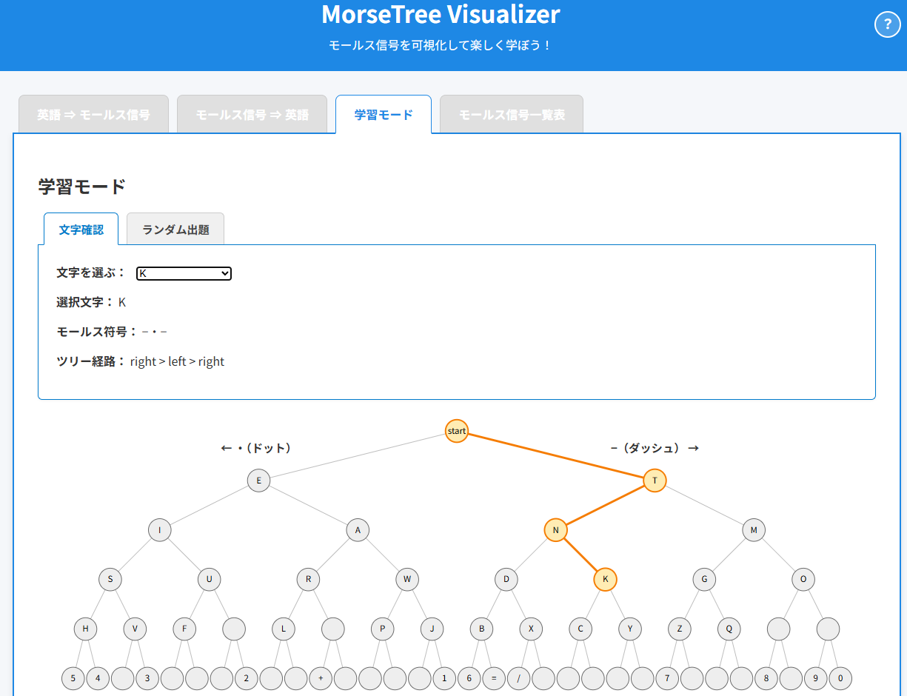

# MorseTree Visualizer - モールス信号を視覚化する学習ツール


**Day025 - 生成AIで作るセキュリティツール100**

**MorseTree Visualizer** は、モールス信号を視覚的に学べるインタラクティブなWebツールです。  
シンプルな変換器ではなく、「モールス脳」を育てる体験を提供することを目的としています。

---

## 🔗 デモページ

👉 [https://ipusiron.github.io/morse-tree-visualizer/](https://ipusiron.github.io/morse-tree-visualizer/)

---

## 📸 スクリーンショット

>
>
>*ダミー*

---

## ✨ 特徴

- 英字・数字・記号に対応した**完全なモールス信号一覧表**
- **3グループ（英字・数字・記号）**で視覚的に整理
- **レスポンシブ対応**：PCでもスマホでも見やすい
- 将来的に以下の機能も実装予定：

---

## 🚧 今後の実装予定（ロードマップ）

| 機能                           | 説明                                       |
|--------------------------------|--------------------------------------------|
| 英語 ⇒ モールス変換           | 入力文字列をリアルタイムで変換＆ツリー表示 |
| モールス ⇒ 英語復号           | モールスを逆変換し、経路をトレース表示     |
| モールスツリーの点灯アニメ    | 経路に沿ってノードを点灯・音再生対応       |
| 学習モード（フラッシュカード） | 任意文字 or ランダム出題で習熟を促進       |

---

## 🖼️ スクリーンショット

> 📷 一覧表示画面  
>  ← 必要に応じて設置

---

## 📁 ディレクトリ構成（抜粋）

```
morse-tree-visualizer/
├── index.html
├── style.css
├── js/
│ ├── script.js
│ ├── table.js
│ ├── morseMap.js
│ └── morseTree.js
├── assets/
│ └── screenshot.png
```

---

## 🚀 使い方

### ✅ 方法①：デモページを開く（推奨）

以下のURLから、ブラウザ上でそのままツールを使用できます。

🔗 [https://ipusiron.github.io/morse-tree-visualizer/](https://ipusiron.github.io/morse-tree-visualizer/)

---

### ✅ 方法②：ローカルで動作確認する

1. このリポジトリをダウンロード or クローンします。
2. 以下のようにローカルでHTTPサーバーを起動してください。

例（Python使用）：

```bash
cd morse-tree-visualizer
python -m http.server 8000
```

3. ブラウザで以下を開きます。

```
http://localhost:8000/
```

---

### ⚠ なぜ HTTP サーバーが必要なの？

本ツールは、JavaScriptモジュール（ES Modules）を使用しています。

`<script type="module" src="...">`により分割された .jsファイルを読み込んでいます。
file:// で直接開くと、**ブラウザのセキュリティ制約（CORSポリシー）** によりエラーになります。
そのため、必ず http:// や https:// 経由でアクセスする必要があります。

---

## 📄 ライセンス

MIT License - 詳細は[LICENSE](LICENSE)をご覧ください。

---

## 🛠 このツールについて

本ツールは、「生成AIで作るセキュリティツール100」プロジェクトの一環として開発されました。
このプロジェクトでは、AIの支援を活用しながら、セキュリティに関連するさまざまなツールを100日間にわたり制作・公開していく取り組みを行っています。

プロジェクトの詳細や他のツールについては、以下のページをご覧ください。

🔗 [https://akademeia.info/?page_id=42163](https://akademeia.info/?page_id=42163)
