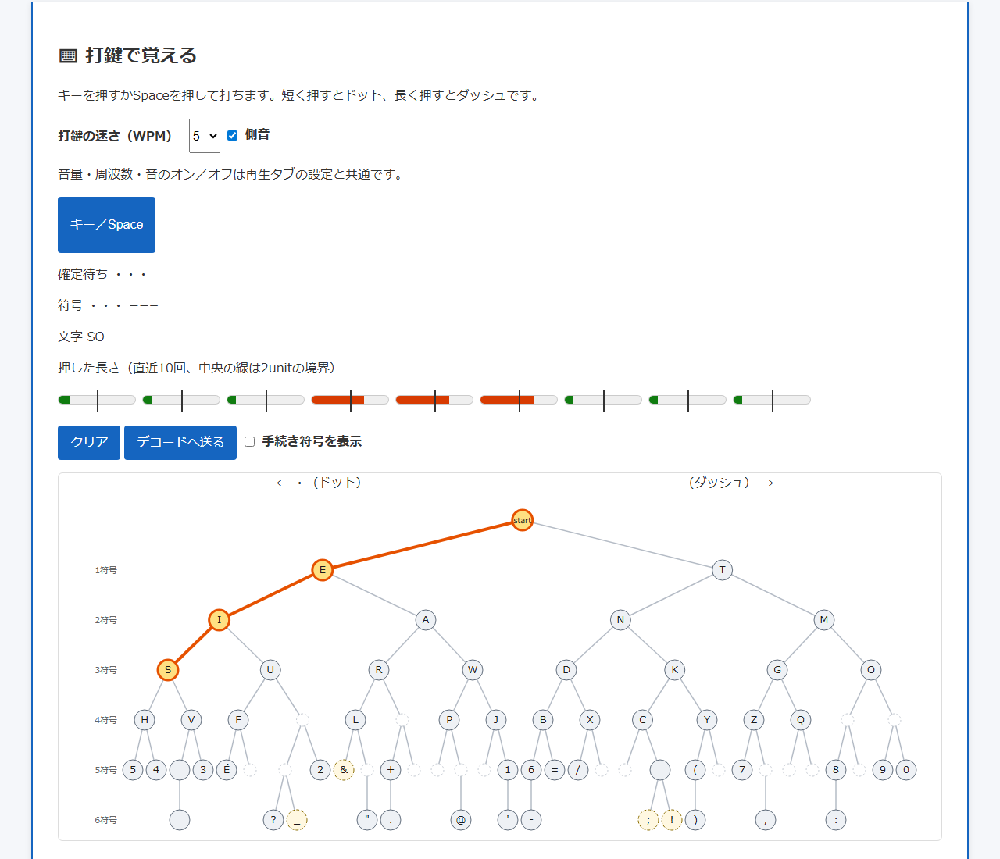
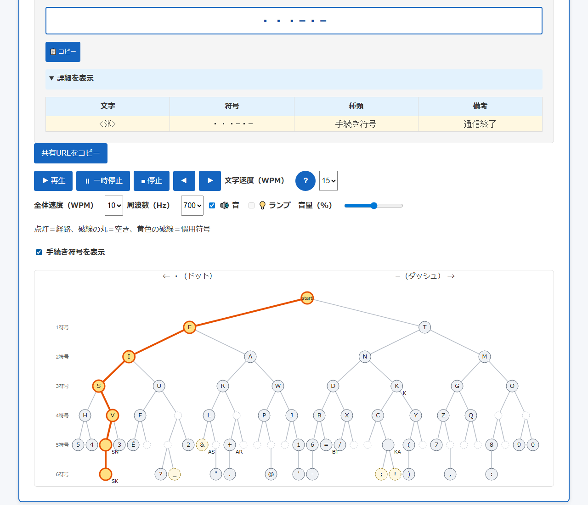
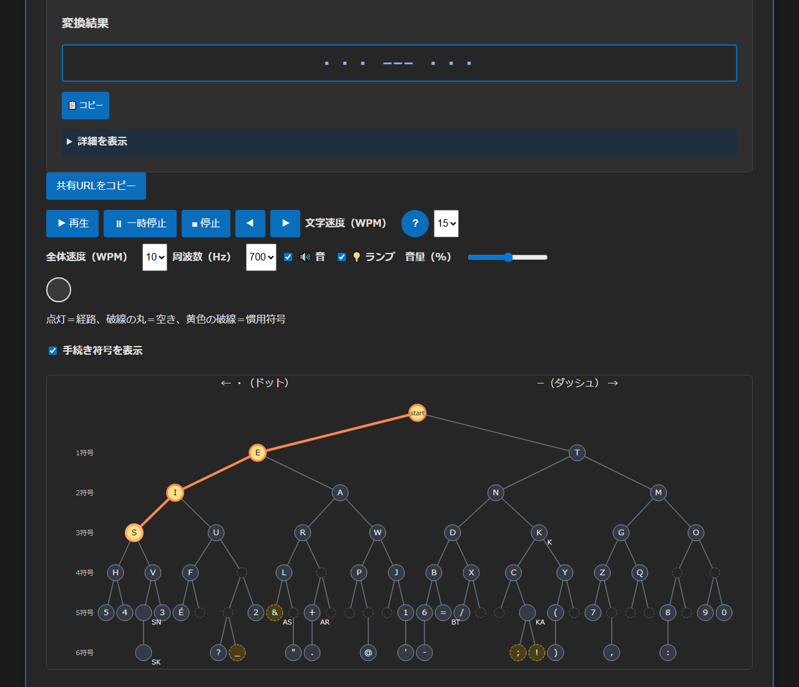

<!--
---
id: day025
slug: morse-tree-visualizer

title: "MorseTree Visualizer"

subtitle_ja: "モールス信号を視覚化する学習ツール"
subtitle_en: "Interactive Morse Code Learning Tool with Binary Tree Visualization"

description_ja: "モールス信号をバイナリツリー構造で視覚化し、エンコード・デコード・学習モードを通じて直感的に学べるインタラクティブなWebツール"
description_en: "An interactive web tool that visualizes Morse code as a binary tree structure, enabling intuitive learning through encoding, decoding, and study modes"

category_ja:
  - モールス信号
  - 符号化
category_en:
  - Morse Code
  - Encoding

difficulty: 2

tags:
  - binary-tree
  - visualization
  - education
  - encoder
  - decoder

repo_url: "https://github.com/ipusiron/morse-tree-visualizer"
demo_url: "https://ipusiron.github.io/morse-tree-visualizer/"

hub: true
---
-->

# MorseTree Visualizer - モールス符号を木の上の経路として学ぶ可視化ツール


[](https://ipusiron.github.io/morse-tree-visualizer/)

**Day025 - 生成AIで作るセキュリティツール100**

**MorseTree Visualizer**は、単なる変換ツールではありません。
入力された文字のモールス信号を、モールスツリー上の経路として順に点灯表示します。

「モールス脳」を育てる、視覚×体験型のインタラクティブ学習ツールです。

## 🌐 デモページ

[ブラウザーでMorseTree Visualizerを開く](https://ipusiron.github.io/morse-tree-visualizer/)

## 📸 スクリーンショット


> *SOSを変換し、SとOの経路を同時に点灯した状態。詳細表は閉じています。*


> *ASCIIの「.-.. --- ...- .」を復号した結果と詳細表、木の経路です。*


> *符号→文字のクイズでQに正解し、正答1／出題1（連続1）を表示しています。*


> *英字・数字・記号の3グループとバッジ、&の注記を確認できます。*


> *SOSを打ち、SOが確定したあと、最後のSが確定待ちで点灯中の状態です。押した長さも確認できます。*


> *エンコードタブで「<SK>」を変換し、手続き符号のラベルを表示しています。*


> *SOSの再生後のSの経路、音の設定、ランプをダークテーマで表示しています。*

## ✨ 機能

- 英語⇒モールス、モールス⇒英語、学習、一覧表、打鍵の5タブ
- ASCIIの`.-`と`・−`の入力・表示・コピー
- ITUタイミングに沿った経路再生、一時停止・再開・停止・前後の手動ステップ
- 音と木の点灯の同期、周波数・音量・小さなランプの選択
- 文字速度と全体速度を分けるFarnsworth方式（文字速度5〜25WPM）
- Spaceキー・マウス・タッチでの打鍵と側音、押した長さの表示
- 手続き符号9件、1,000文字までの入力を含むURLの共有
- ライト・ダーク・システム連動のテーマと一覧表のPDF印刷
- デコード欄へ入力中の符号を木がリアルタイムに追う機能
- 双方向クイズ、出題範囲の選択、セッション内の正答数と連続正解
- ITU 50文字と慣用5文字の区別、深さ6の木と「木の外」の注記
- キーボード操作とモバイル対応（木は縮小せず、箱の中を横スクロール）

## 📖 使い方

### 📝 英語 ⇒ モールス変換

1. 「英語 ⇒ モールス信号」タブを選択
2. テキスト入力欄に英語を入力（例：HELLO）
3. 「エンコード＆表示」ボタンをクリック
4. モールス信号が表示され、ツリー上でアニメーション表示
5. 「📋 コピー」ボタンでクリップボードにコピー可能

### 🔓 モールス ⇒ 英語復号

1. 「モールス信号 ⇒ 英語」タブを選択
2. モールス信号を入力（手入力または文字ボタン使用）
3. ASDF GHJK・SOS・HELLO WORLD・CQ CQ DE JA1ABCのサンプルから選択
4. 「デコード」ボタンまたは入力欄のEnterで実行（Shift+Enterは改行）
5. 英語に復号され、木の経路を再生

### 📚 学習モード

- **文字確認**: 文字を選択してモールス信号と経路を確認
- **ランダム出題**: 符号→文字または文字→符号を選び、英字・数字・記号の範囲で回答。Enterで答え合わせ、もう一度Enterで次の問題

### 📊 モールス信号一覧表
英字27・数字10・記号18・手続き符号9件の対応を確認できます。ITUと慣用のバッジを付け、表記の切り替えも反映します。

### ⌨ 打鍵

1. 「⌨ 打鍵」タブを選択し、打鍵の速さを選ぶ。
2. 「キー／Space」ボタンかSpaceキーを短く押してドット、長く押してダッシュを入れる。
3. 確定待ちの符号・文字・押した長さのバーを確認する。
4. 「デコードへ送る」で入力した符号を復号タブへ移す。

手続き符号は英文欄に`HELLO <AR>`のように山かっこで囲んで入力します。
`AR`の2文字を続けて打つのではなく、1つの符号として送ります。

### 入力と変換の例

エンコードの改行・タブ・全角空白は語の区切りになります。表中の「（改行）」は実際の改行、「（空白3つ）」は半角空白3つを表します。

| 操作 | 入力 | 結果 |
|---|---|---|
| encode | `SOS` | `・・・ −−− ・・・` |
| encode | `HELLO WORLD` | `・・・・ ・ ・−・・ ・−・・ −−− / ・−− −−− ・−・ ・−・・ −・・` |
| encode | `Hello,（改行）World!` | `・・・・ ・ ・−・・ ・−・・ −−− −−・・−− / ・−− −−− ・−・ ・−・・ −・・ −・−・−−` |
| decode | `.- ...` | `AS` |
| decode | `.-（空白3つ）...` | `A S` |

表示表記を切り替えると結果・コピー・一覧表も切り替わります。たとえばSOSはASCII表記で`... --- ...`です。
変換後は自動で再生します。動きを減らす設定のブラウザーでは、文全体の経路を一度に点灯します。手動ステップはどちらでも使えます。

### WPM（再生速度）

WPMはモールス信号の速さです。数値が小さいほどゆっくり、大きいほど速く再生します。20 WPMは10 WPMの2倍の速さです。
木の経路をゆっくり確認したいときは、5 WPMから試してください。変更後は「再生」を押すと、選んだ速さで最初から再生します。

エンコード・デコードのWPMの隣にある「?」からも説明を読めます。マウスを重ねるか、タップ、キーボードでフォーカスすると表示します。
Esc、もう一度のクリック・タップ、または説明の外をクリック・タップすると閉じます。Tabで次の操作へ移っても閉じます。
動きを減らす設定ではWPMにかかわらず全経路が一度に点灯するため、経路を順に確認するには手動ステップを使ってください。

## 📐 画面構成

上部に5つのタブと表記の選択、各変換タブに入力・結果・再生制御・木を配置しています。
学習タブは文字確認とランダム出題に分かれます。ヘルプは右上の「？」から開けます。

- タブ移動：←／→、先頭・末尾：Home／End
- デコード実行：入力欄のEnter、改行：Shift+Enter
- クイズ回答・次問：回答欄のEnter
- ヘルプを閉じる：Esc。閉じると開いたボタンへフォーカスが戻る

## 🎯 ユースケース

- モールス信号初心者や趣味の学習者の文字と符号の対応練習
- アマチュア無線での符号学習の補助
- 情報技術・STEM教育での信号処理の説明
- プログラミング講師による二分木と探索経路の可視化
- セキュリティエンジニアによる符号化と暗号の違いの学習

## 🔊 音とFarnsworth

文字速度を18WPM、全体速度を5WPMにすると、符号の音は18WPMのまま、文字と語の間を長く取れます。
初期値は文字速度15WPM・全体速度10WPM、700Hz・音量50%です。全体速度は文字速度以下に制限します。
音はユーザー操作のあとに開始します。音を使えない環境では、木だけで学習できます。

文字速度をc、全体速度をsとしたとき、1unitは`1200/c`msです。
s<cでは`a=(60c−37.2s)/(s×c)×1000`msを計算し、文字間を`3a/19`、語間を`7a/19`に置き換えます。
元の3unit・7unitに加算する式ではありません。s=cでは通常の時間比を使います。

| 文字速度c | 全体速度s | unit（ms） | 文字間（ms） | 語間（ms） |
|---|---|---|---|---|
| 15 | 15 | 80.0 | 240.0 | 560.0 |
| 18 | 10 | 66.7 | 621.1 | 1449.1 |
| 18 | 5 | 66.7 | 1568.4 | 3659.6 |

PARISの末尾に次の語までの間隔を含めると、1語は60/s秒になります。18/5WPMなら12秒です。
計算は[ARRLのFarnsworth方式](https://www.arrl.org/files/file/Technology/x9004008.pdf)に基づきます。

ランプは40px角、初期状態ではオフです。点滅する面を小さくするための設計で、画面全体は点滅させません。
動きを減らす設定ではランプを表示せず、木は一括点灯しますが、音の間隔は変わりません。
点滅の面積と回数に関する根拠は[WCAG 2.3.1](https://www.w3.org/WAI/WCAG22/Understanding/three-flashes-or-below-threshold.html)です。

## ⌨️ 打鍵で覚える

打鍵の速さから求めた1unitをuとし、押す長さが2u未満ならドット、2u以上ならダッシュと判定します。
次に押すまでの間隔は2u未満が同じ文字、2u以上5u未満が次の文字、5u以上が次の語です。
10WPMではu=120msなので、300msの間隔を空けてSとOを打つと`SO`になります。

次の押下がない場合は、離して2u後に確定待ちの符号を表示し、5u後に文字、10u後に語の区切りを確定します。
文字が確定すると木の点灯は消えます。入力欄やセレクトにフォーカスがあるときのSpaceは打鍵に使いません。
側音の音量・周波数・音のオン／オフは再生タブと共有します。

## 📡 手続き符号

| 名前 | ASCII符号 | 意味 | 区分 | 同じ符号の文字 |
|---|---|---|---|---|
| AR | `.-.-.` | 送信終了 | ITU | + |
| SK | `...-.-` | 通信終了 | ITU | — |
| BT | `-...-` | 区切り | ITU | = |
| KA | `-.-.-` | 開始 | ITU | — |
| SN | `...-.` | 了解 | ITU | — |
| HH | `........` | 訂正 | ITU | — |
| K | `-.-` | 送信どうぞ | ITU | K |
| AS | `.-...` | 待て | ITU | & |
| SOS | `...---...` | 救難 | 慣用 | — |

ここでいう1符号のSOSはITU-R M.1677-1にはないため、慣用として区別しています。
`SOS`は3文字、`<SOS>`は9要素が連続する1符号です。HHとSOSは深さ6の木の外にあり、文字列と詳細表で確認します。
「手続き符号を表示」をオンにすると、木にAR・SK・BT・KA・SN・K・ASのラベルが付きます。
符号が文字と重なる場合、復号は文字を優先します。たとえば`.-.-.`は`+`、`.-...`は`&`です。

## 🔗 入力の共有

エンコード・デコードの「共有URLをコピー」で、入力を含むURLを作れます。上限は1,000文字です。
`?text=SOS`または`?morse=...%20---%20...`で開くと対応するタブへ入力し、変換します。両方の指定はエラーです。
共有URLを開いただけでは音を鳴らしません。URLには入力が残るため、秘密の文字列は共有しないでください。

## 🎨 テーマ

ヘッダーのテーマボタンはライト→ダーク→システム連動の順に切り替わります。
初期状態はシステム連動で、選択はlocalStorageへ保存します。保存を禁止した環境でも切り替えられます。

## 🖨️ 印刷（PDF保存）

一覧表タブの「印刷（PDFに保存）」を押し、ブラウザーの印刷ダイアログで「PDFに保存」を選びます。
英字27＋数字10＋記号18＋手続き符号9＝64行を2列にし、ASCIIと「・−」の両方を載せます。
印刷はダークテーマでもライト配色です。ChromiumではA4縦の1ページに収まることを確認しています。

## 🔬 技術的な説明

### 文字表と木

`MORSE_TABLE`を唯一の文字表とし、英字27（A〜ZとÉ）、数字10、記号18（ITU 13＋慣用5）の計55文字を定義しています。
ITU 50文字と慣用5文字を含みます。木はこの表から生成し、深さ5までの空ノードを補います。
手続き符号も含めると深さ6までで76ノード、葉34、深さ6のノード13です。葉へ左から30px間隔で座標を割り当て、親のx座標を存在する子の平均にします。

左の枝がドット、右の枝がダッシュです。破線の丸は空き、黄色い破線は慣用符号を示します。
`$`は7符号なので木の外です。変換・復号と詳細表には対応しますが、再生中も木は光りません。

| 区分 | 文字 | ASCII符号 |
|---|---|---|
| ITU | `.` | `.-.-.-` |
| ITU | `,` | `--..--` |
| ITU | `:` | `---...` |
| ITU | `?` | `..--..` |
| ITU | `'` | `.----.` |
| ITU | `-` | `-....-` |
| ITU | `/` | `-..-.` |
| ITU | `(` | `-.--.` |
| ITU | `)` | `-.--.-` |
| ITU | `"` | `.-..-.` |
| ITU | `=` | `-...-` |
| ITU | `+` | `.-.-.` |
| ITU | `@` | `.--.-.` |
| 慣用 | `!` | `-.-.--` |
| 慣用 | `&` | `.-...` |
| 慣用 | `;` | `-.-.-.` |
| 慣用 | `_` | `..--.-` |
| 慣用 | `$` | `...-..-` |

`&`の符号はITUのWait（待て）の手続き符号ASと同じです。`&`は文字、`<AS>`は手続き符号として入力できます。
`É`（accented e）はITUにある`..-..`です。

### 時間比と速度

ITU-R M.1677-1の§2に従い、ドット1・ダッシュ3・要素間1・文字間3・語間7の時間比を使います。
1unitは`1200/WPM`msで、10WPMなら120msです。
PARISは文字と文字間で43unit、次の語までの7unitを加えて50unitとなります。
10/10WPMではSOSは27unit＝3,240ms、HELLO WORLDは111unit＝13,320msです。
音が使える場合はWeb Audioへ音を予約し、`AudioContext.currentTime`を基準に`requestAnimationFrame`で木を更新します。
音なしではタイマーで再生します。描画フレームやブラウザーの処理負荷による遅れは生じます。
打鍵では`performance.now()`で押下と解放の時刻を取り、2u・5uの境界から符号と区切りを判定します。

### 入力の正規化

英文はNFKC正規化→大文字化→連続空白を1つにまとめる順で処理します。
未対応文字が1つでもあれば変換を中止し、文字とU+XXXXを表示します。

| 用途 | 受け付ける記号・空白 |
|---|---|
| ドット | `.`、`・`、`·`、`•`、`∙`、`。` |
| ダッシュ | `-`、`−`、`–`、`—`、`―`、`_`、`ー`、`－` |
| 文字の区切り | 半角空白・タブ・NBSP（U+00A0）・全角空白（U+3000） |
| 語の区切り | `/`、縦棒（U+007C）、改行（LF／CR）、空白3つ以上 |

復号時はASCIIへ正規化します。空白2つまでは文字の区切りです。先頭・末尾や連続した語の区切りは空の語を作りません。
`...---...`は手続き符号`<SOS>`へ復号します。S・O・Sの3文字なら`... --- ...`と入力します。
クイズの抽選には`crypto.getRandomValues`と剰余の偏りを避ける処理を使い、直前の文字は候補から外します。

## 🔒 セキュリティ

画面は入力を`textContent`で描画し、HTMLとして解釈しません。インラインイベント・style属性を除き、meta CSPで同一オリジンのスクリプトとCSSに制限しています。
referrerは`no-referrer`、外部リンクは`noopener noreferrer`です。ページを開いて操作したときの外部ホストへの要求はChromiumで0件でした。
テーマのみを保存し、入力や成績は自動保存しません。共有URLには明示的に入力を含めるため、共有先やブラウザーの履歴に残ることがあります。

meta CSPではクリックジャッキングを防げません。`frame-ancestors`はHTTPヘッダー専用で、GitHub Pagesでは任意のレスポンスヘッダーを設定できません。
外部のGitHubリンクを利用者が開いた場合は、そのサイトへの通信が発生します。

## ⚠️ 注意

- `file://`では動作しない。ES moduleを同一オリジンとして読み込めないブラウザーの制約があるため、HTTP配信が必要
- 大文字化により`ß`→`SS`など文字数が変わる場合がある
- アクセント文字はÉ以外に非対応
- 慣用符号は通信環境によって異なる場合がある
- iOSでは音の開始にタップが必要。iOS実機は未検証
- 和文モールス・英語UI・PNG保存は未対応

## ❓ FAQ

### 音が出ない理由

「音」がオンか、音量が0になっていないかを確認し、「再生」を押してください。
ブラウザーの自動再生ポリシーにより、最初に操作が必要です。音を使えない環境では木の表示だけで動きます。

### 入力中の木と変換結果の違い

デコード欄への入力中は、最後の符号の経路だけを追います。復号結果を更新するにはデコードボタンかEnterで実行します。

### スマートフォンで木が横長になる理由

文字を読める大きさに保つため、木のSVGは1080×470pxで表示します。ページ全体ではなく木の箱の中を横スクロールします。

## 🔗 参考

- [ITU-R M.1677-1 “International Morse code”](https://www.itu.int/rec/R-REC-M.1677-1-200910-I/en)（Annex 1 Part Iの文字表と§2の時間比）
- [ARRL “A Standard for Morse Timing Using the Farnsworth Technique”](https://www.arrl.org/files/file/Technology/x9004008.pdf)（PARIS基準と文字間・語間の計算）
- [WCAG 2.3.1](https://www.w3.org/WAI/WCAG22/Understanding/three-flashes-or-below-threshold.html)（点滅の回数と面積）
- [MDN Web Audio API best practices](https://developer.mozilla.org/en-US/docs/Web/API/Web_Audio_API/Best_practices)（音声開始時のユーザー操作）

## 🧪 テスト

Node 22以上で`npm test`を実行します。依存パッケージのインストールは不要です。
GitHub Actionsもpushとpull_requestで同じテストを実行します。READMEの例・表・画像参照も検証対象です。

| ファイル | 検証する内容 |
|---|---|
| codec.test.js | 正規化・変換・往復・境界・エラー |
| table.test.js | 55文字・ITU／慣用・一意性・順序 |
| tree.test.js | 文字表のみ75ノード・手続き符号込み76ノード・葉34・座標 |
| timing.test.js | ITU時間比・Farnsworth・PARIS・SOSの音の予定表 |
| messages.test.js | 辞書とJS内の日本語リテラル |
| html.test.js | CSP・referrer・ARIA・属性とラベル |
| contrast.test.js | 配色の4.5:1以上 |
| format.test.js | 行数・行長 |
| readme.test.js | 表・例・YAML・ツリー・画像 |
| keying.test.js | 打鍵の2u・5uの境界と乱れた入力 |
| prosign.test.js | 手続き符号9件・変換・復号と別名 |
| share.test.js | URLの解析・1,000文字制限・生成 |
| theme.test.js | 保存の失敗とテーマの変数集合 |
| static.test.js | 印刷用CSS・禁止する通信手段 |

## 📁 ディレクトリー構造

```text
morse-tree-visualizer/              # モールス符号を木の経路として学ぶツール
├── .github/                        # GitHubの設定
│   └── workflows/                  # 自動テストの設定
│       └── test.yml                # pushとpull_requestでNode 22のnpm testを実行
├── .gitignore                      # 依存フォルダー・ログ・個人設定をGit管理から除外
├── .nojekyll                       # GitHub PagesのJekyll処理を無効化
├── CLAUDE.md                       # AI向けの開発ガイド
├── LICENSE                         # MITライセンス
├── README.md                       # 使い方・仕様・検証の説明
├── assets/                         # README用の画像
│   ├── screenshot.png              # SOSの変換結果とS・Oの点灯
│   ├── screenshot2.png             # LOVEの復号結果と詳細表
│   ├── screenshot3.png             # Qの正解と成績
│   ├── screenshot4.png             # ITUと慣用の一覧表
│   ├── screenshot5.png             # 打鍵でSOが確定し最後のSが確定待ちの状態
│   ├── screenshot6.png             # SKの詳細表と手続き符号のラベル
│   └── screenshot7.png             # ダークテーマのSOSと音の設定
├── index.html                      # 5タブ・ヘルプ・CSPのマークアップ
├── js/                             # JavaScriptのES module
│   ├── animator.js                 # 1符号ずつの再生と一時停止・手動ステップ
│   ├── audio.js                    # Web Audioの音の予約と打鍵側音
│   ├── decode.js                   # 復号と入力支援・リアルタイム追従
│   ├── encode.js                   # 英文の変換と結果・コピー・再生
│   ├── frequency.js                # Day018由来の英字出現頻度
│   ├── keying.js                   # 押し離しから符号と文字を確定する打鍵タブ
│   ├── layout.js                   # 木の見た目の保存と4か所の同期
│   ├── messages.js                 # 動的な画面文言の日本語辞書
│   ├── morseCodec.js               # 入力正規化・変換・経路・ITUタイミング
│   ├── morseMap.js                 # 55文字と手続き符号9件の定義・表記
│   ├── morseTree.js                # 文字表から木を生成し座標を決定
│   ├── script.js                   # 起動・タブ・ヘルプの操作
│   ├── share.js                    # 共有URLの入力解析と生成
│   ├── study.js                    # 文字確認・クイズ・成績
│   ├── table.js                    # ITUと慣用を区別する一覧表
│   ├── theme.js                    # ライト・ダーク・システム連動と保存
│   ├── treeRenderer.js             # 木ごとのSVG描画と点灯・追従
│   ├── trivia.js                   # 雑学タブで使う計算ロジック
│   └── utils.js                    # 安全なDOM生成と共通制御
├── package.json                    # 依存なしのnpm test定義
├── style.css                       # 配色変数とモバイル・木の表示
└── test/                           # 依存なしの自動テスト
    ├── chart.test.js               # チャート型の66ノード座標と衝突
    ├── codec.test.js               # 変換例・往復・正規化・境界
    ├── contrast.test.js            # 文字と面の4.5:1以上
    ├── format.test.js              # 行長と行数
    ├── frequency.test.js           # 英字出現頻度の正規化と順位
    ├── html.test.js                # CSP・ARIA・属性とラベル
    ├── keying.test.js              # 打鍵の時間境界と符号・文字の確定
    ├── messages.test.js            # 辞書と日本語リテラルの集約
    ├── prosign.test.js             # 手続き符号9件と変換・復号
    ├── readme.test.js              # 表・例・画像・ツリー・YAML
    ├── share.test.js               # 共有URLの解析と長さ制限
    ├── static.test.js              # 印刷用CSSと外部通信手段なしの検証
    ├── table.test.js               # 文字表の件数・順序・符号
    ├── theme.test.js               # テーマの保存と変数集合の検証
    ├── timing.test.js              # ITU時間比とPARIS・SOS
    ├── tree.test.js                # 文字表75・手続き符号込み76ノード・葉34・座標
    └── trivia.test.js              # 実行時に計算する雑学の数値
```

## 💻 動作環境

モダンブラウザーとHTTP配信が必要です。WindowsのChromiumで、1280・390・320pxの表示と主要操作を確認しています。
Firefox・Safariは今回の実機検証対象外です。サーバー以外のビルド処理はありません。

1. このリポジトリーをダウンロードまたはクローンする。
2. ローカルHTTPサーバーを起動する。

```bash
cd morse-tree-visualizer
python -m http.server 8000 --bind 127.0.0.1
```

3. ブラウザーで`http://127.0.0.1:8000/`を開く。

`file://`で直接開くとモジュールの読み込みが拒否されることをChromiumで確認しています。

## 📄 ライセンス

MIT License - 詳細は[LICENSE](LICENSE)をご覧ください。

## 🛠️ このツールについて

本ツールは、「生成AIで作るセキュリティツール100」プロジェクトの一環として開発されました。
このプロジェクトでは、AIの支援を活用しながら、セキュリティに関連するさまざまなツールを100日間にわたり制作・公開していく取り組みを行っています。

プロジェクトの詳細や他のツールについては、以下のページをご覧ください。

🔗 [https://akademeia.info/?page_id=42163](https://akademeia.info/?page_id=42163)
